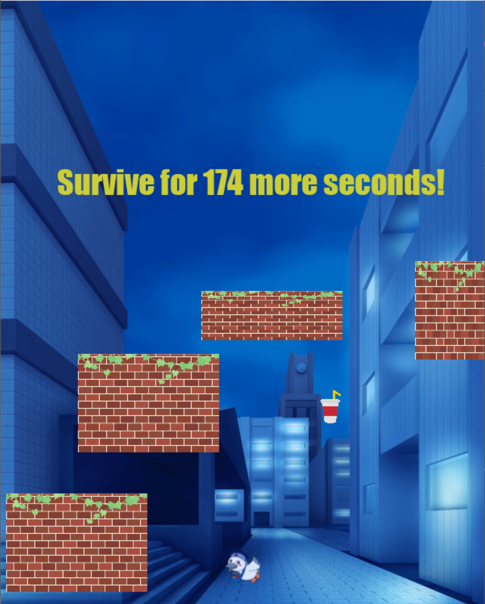

# 生き延びろ!こうかとん！

## 実行環境の必要条件
* python >= 3.10
* pygame >= 2.1

## ゲームの概要
* こうかとんを振ってくる障害物から3分間生き残れ！

## ゲームの遊び方
* Enterキーでゲームスタート
* 矢印キーでこうかとんを操作する
* 障害物に当たるとゲームオーバー
* 3分生き残れたらゲームクリア

## アイテム効果
- ジュースを取ると、5秒動きが速くなる
- タイマーを取ると、3秒動きが遅くなる
- ミラーを取ると、左右の動きが4秒反転する
- シールドを取ると、8秒間無敵になる。

## ゲームの実装
### 共通基本機能
* 背景画像と主人公キャラクターの描画
* こうかとんの移動

### 分担追加機能
* 時間経過でサイズと速度が増加する、障害物の速度が増加する　C0A24038 宇都宮恵大
* 衝突判定、障害物に当たるとゲームオーバー　C0A24034 上田隼
* 障害物の配置（3，4種類くらい） C0A24030 井上春弥
* 時間の計測と表示、スタートとクリア画面　C0A24282　蕨蒼鷹
* 有利、不利になるアイテムの配置、効果設定 C0A24054 大山晃季

### メモ
* スタートとクリア画面に効果音を出す
* クラス内の変数は，すべて，「get_変数名」という名前のメソッドを介してアクセスするように設計してある
* すべてのクラスに関係する関数は，クラスの外で定義してある

## ゲーム画面のスクショ

